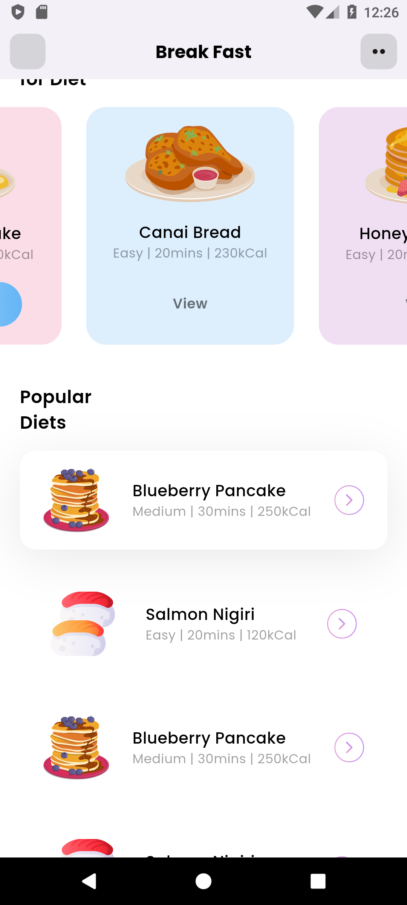

## Basic Flutter UI for an App

I made a Basic UI for an App (used template from *Dribbble*) using **Flutter**

## \__UI Design

**ScreenShots**

| *Home Page* | *Scroll Down Page* |
|-----------|-------------------|
|  |  |
